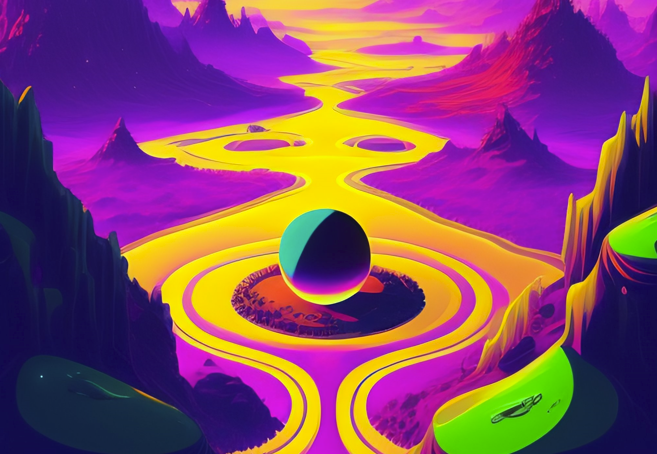

# Midjourney Reborn 🔥

A Discord bot for all your Midjourney needs! Use this bot to convert text prompts into beautiful artwork via Midjourney V4.

<div align=left>

</div>


## Usage

To run this demo, clone the repository and then create a `config.json` file containing your bot's token.

```sh
git clone https://github.com/oelin/midjourney-reborn/

cd midjourney-reborn
```

```sh
echo {"token": "YOUR TOKEN"} > ./config.json
```

Then run the following commands to install start the bot.

```sh
npm i

npm run deploy

npm start
```


## Commands

This project is in active development so expect lots of changes to this section. Currenlty the primary command supported is `/imagine [prompt]`, which can be used to generate images with Midjourney. For instance, `/imagine an astronaut riding a horse on mars artstation` might produce the following image:


In the near future we hope to add support for features such as upscailing, variant generation and additional generation parameters. 


## Technologies

This bot utilizes [discord.js](https://discord.js.org/#/) and [Midjourney Client](https://github.com/oelin/midjourney-client) to enable Midjourney V4 access from within Discord. The underlying images are generated on fast GPUs provided by [Replicate](https://replicate.com).


## Resources

* [Midjourney Website](https://www.midjourney.com/home/?callbackUrl=%2Fapp%2F)
* [Midjourney/Openjourney on Replicate](https://replicate.com/prompthero/openjourney)
